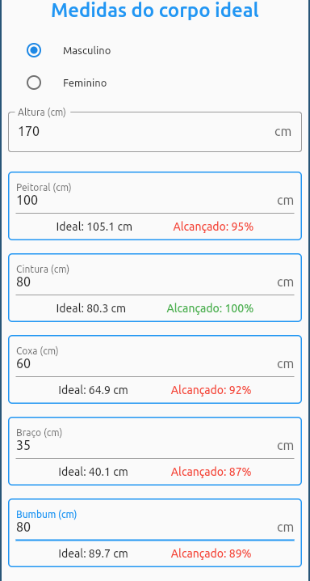
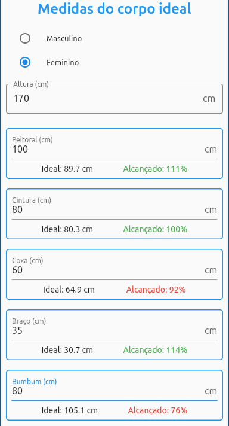

# ideal_proportion

Esse app tem o objetivo de calcular algumas sugestões das proporsões ideais de corpos adultos para homens e mulheres, seguindo as proporções áureas e usando o [número do Fibonacci](https://pt.wikipedia.org/wiki/Sequ%C3%AAncia_de_Fibonacci).

## Exemplo de corpo masculino
 

## Exemplo de corpo feminino
 

---

Este projeto usa Flutter, um framework da linguagem Dart.

## Pré-requisitos
* Dart 2.14.4
* Flutter 2.15.1

Se você quiser saber mais sobre a Flutter, visite seu site: http://flutter.dev/.

## Executando o aplicativo

Você pode executar seu aplicativo em qualquer sistema operacional com ambiente de desolvimento configurado, por exemplo Android, iOS, Linux, Windows e MacOS. Usando o comando:
```
flutter run
```

## Criação de apk Android

Você pode criar um executável nativo usando
```
flutter build apk
```

Ele produz o arquivo `app-release.apk` no diretório `build/app/outputs/apk/release/`.


Se você quiser saber mais sobre como gerar apk Android, consulte https://docs.flutter.dev/deployment/android#build-an-apk
